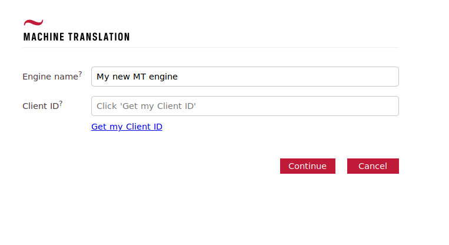
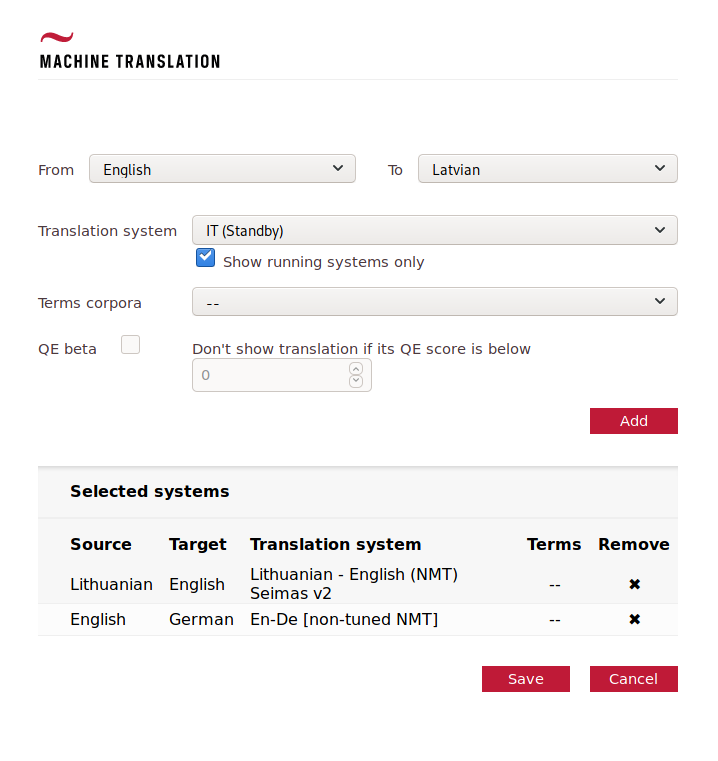

# Tilde MT system selection web component
The Tilde MT system selection [web
component](https://en.wikipedia.org/wiki/Web_Components) is a standalone tool
that provides a user interface for managing the configuration of Tilde MT API
access parameters. It's intended for use in web-based apps that integrate with
the Tilde MT API. Efectively, it
1. lets the end-user configure MT engines by selecting one or more MT systems
   on the Tilde MT platform for different language pairs;
2. provides the service provider the resulting configuration in form of JSON
   that can then be used to make translation requests to the selected MT systems
   via the Tilde MT API.

In more detail -- the web component allows the user to authenticate in the Tilde
MT web platform and retrieves a list of machine translation systems available to
the user. A different system can be selected for each of the available source
and target language pairs. The web component automatically manages the retrieval
of the system list, configuration of the individual translation systems, and
provides the appropriate request parameters to be used when making a text
translation request to the Tilde MT API.

The implementation is a single file of vanilla JS. When using the
[webcomponents.js](https://github.com/webcomponents/webcomponentsjs) polyfill,
browser support should go back as far as IE10.




## Prerequisites
You might want to include the [webcomponents.js](https://github.com/webcomponents/webcomponentsjs)
polyfill to support older browsers. There are no other dependencies.

## Usage
To integrate the Tilde MT system selection web component in a web-based CAT tool
or in a similar web app one must implement several steps which consist of:
* inserting the `tildemt-selector` custom element in you page's HTML;
* managing the component's lifecycle by attaching event handlers in JavaScript
or by manually triggering state transitions;
* using the state, exported from the web component, to make translation requests
to the Tilde MT API;
* persisting and restoring the state to allow subsequent editing of the
web component's configuration;
* optionally customizing the web component's UI.

### Including the web component
It should be as simple as
```HTML
<html>
<head>
    <link rel="import" href="path-to/tildemt-selector.html">
</head>
<body>
	<tildemt-selector id="tildemt" ></tildemt-selector>
</body>
</html>
```

### Managing the component's lifecycle
During her interaction with the component, the user can save the component's
state, cancel the changes she's made, or log out from the component
effectively dropping any previous configuration she's made. These interactions
can be managed in two ways:
* by attaching event handlers to listen for state changes that are triggered
by interacting with the built-in `save` and `cancel` buttons;
* or by manually calling `saveAndGetState` and `cancel` methods if, for
  example, the `save` and `cancel` buttons are hidden (see [Customizing the
  web component's looks](#customizing-the-web-components-looks-optional)).

The `logout` event cannot be manually triggered. When the component's state
is saved the saved configuration is passed over via the respective event details
or the method return value (depending on whether event handlers vere used or the
`saveAndGetState` and `cancel` methods were called manually).

#### Attaching event handlers
There are three events exposed by the component.

##### save
The save event is used to notify that the `save` button has been pressed
indicating that the user has finished selecting her systems.
```JavaScript
document.getElementById("tildemt").addEventListener("save", function(details){
    // event details contain the selector component's state
    tildemtConfig = details.detail;
    // we'll look at this method in greater detail later
    populateSystemList(tildemtConfig);
});
```

##### cancel
The event is used to notify that the `cancel` button has been pressed
indicating that the user has aborted the system selection process
and wishes to undo the changes she's made.
```JavaScript
document.getElementById("tildemt").addEventListener("cancel", function(){
    // use the component's previous state tildemtConfig
});
```

##### logout
The event notifies that the `logout` button has been pressed indicating that
the web component's state should be dropped so that the user can authenticate
with a different Client ID.
```JavaScript
document.getElementById("tildemt").addEventListener("logout", function(){
    // drop the saved state
    tildemtConfig = undefined;
});
```

#### Manually triggering state changes
The state change can be triggered by either of two method calls. Calling
`saveAndGetState` will manually trigger the component's state save and
will return the state similar to the [save event](#save).
```JavaScript
// this is probably attached to some external save button's event handler or similar
tildemtConfig = document.getElementById("tildemt").saveAndGetState();
```
Calling the `cancel` method will trigger the component's cancel event.
```JavaScript
// this is probably attached to some external cancel button's event handler or similar
document.getElementById("tildemt").cancel();
// use the component's previous state tildemtConfig
```


### Using the configuration
The state object received via the TildeMT web component's `save` event has this
general structure
```JSON
{
    "engineName": "My en-ge and lv-lt engine",
    "client-id": "u-0353d8-ufub-9tga-a59a-io8a3618kb39s",
    "systems": {
		"en-de": {
			"params": {
				"systemID": "smt-83q34k17-2ob6-622l-10hk-1lb669s6ggh0",
				"options": "client=localhost,version=1.0"}},
		"lv-lt": {
			"params": {
				"systemID": "smt-f4b008c1-3152-444b-91f7-2472e0b69b63",
				"options": "client=localhost,version=1.0,qe"}}}
}
```

#### engineName
The user can input a name for her newly created system configuration in the web component to later
identify it. This is useful if the same MT plugin can be used to configure multiple
different translation engines. A single user, for example, could be using the Tilde MT
platform for two different projects each requiring her to access translation systems
belonging to different user groups.

This field is not needed when making calls to the Tilde MT API. If the above described
functionality is not needed then the `engineName` field can be safely ignored
and the input field can be hidden -- see
the [Customizing the web component's
looks](#customizing-the-web-components-looks-optional) section for more details.

#### client-id
Used to authenticate calls to the Tilde MT API. Each call to the API must have a
`client-id` field set in the HTTP request header.

#### systems
An object with keys corresponding to the different language combinations supported.
In the above example the user has selected two translation systems -- for English
to German and Latvian to Lithuanian translations. This is indicated by two ISO 639-1
language codes separated by a dash.

Each of the configured systems contains a `params` object containing multiple
key-value pairs. These should be set as the HTTP GET query parameters for the
API requests for the respective language pair.

An example of a translation request url when translating from Latvian to Lithuanian
could look like this

```
https://letsmt.eu/ws/service.svc/json/TranslateEx?systemID=smt-f4b008c1-3152-444b-91f7-2472e0b69b63&options=client%3Dlocalhost%2Cversion%3D1.0%2Cqe&text=Hello%20world
## don't forget to set the client-id header as well
```

**Note:** The contents of the `params` object is expected to change over time as new
features might be added to the Tilde MT platform. When setting the API request
parameters one should iterate over *all* of the enclosed key-value pairs.

### Persisting the web component's state
It is recommended to persist the whole web component's state object as a JSON
string because the structure of the state object might change in the future
(e.g., new request parameters could be added).
#### Saving
This should be as simple as
```JavaScript
// tildemtConfig is acquired via the web components `save` event's event details
var stateString = JSON.stringify(tildemtConfig);
saveStateJsonInDb(stateString);
```

#### Restoring
After the web component has initially been configured the user might want to edit
the configuration to, for example, change the selected MT system for one or more
languages, add a system for a new language pair, or remove a system altogether.
To facilitate this the web component provides a `setState` method that sets its state
to a previous configuration.
```JavaScript
// the previous configuration could be stored and retrieved as JSON from the backend
var stateString = getStateJsonFromDb();
tildemtConfig = stateString ? JSON.parse(stateString) : undefined;
document.getElementById("tildemt").setState(tildemtConfig);
// show the web component to the user; the web component will now reload the previously
// selected system list
```

### Customizing the web component's looks (optional)
One can change certain features of the web component's UI to better align with the
parent app's visual looks. This is achieved by adding attributes to the component's
HTML tag.
```HTML
<tildemt-selector id="tildemt" hiddenname hiddensave reversebuttons></tildemt-selector>
```

#### hiddenname
Set the attribute to hide the *Engine name* input field.

#### hiddensave
Hides the component's `save` and `cancel` buttons. This is useful if the parent app
already has dedicated UI elements for saving and resetting MT plugins' state.

#### reversebuttons
Changes the order of `save`/`continue` and `cancel` buttons.


## Demo
For a full working example that demonstrates the functionality described above,
see [the demo](./index.html).
### Prerequisites
[Install](https://github.com/PolymerLabs/polyserve) `polyserve`.

### Running
```shell
# get the sources
git clone <link to this repo>
# serve the sources with polyserve
cd tildemt-selector
polyserve
```
The demo should now be up and running on [localhost:8080](http://localhost:8080)
